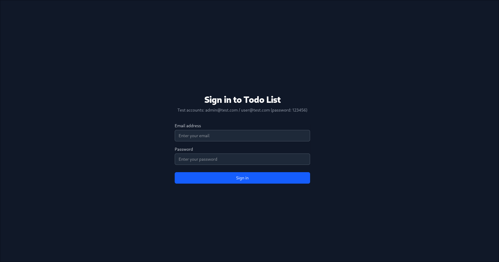
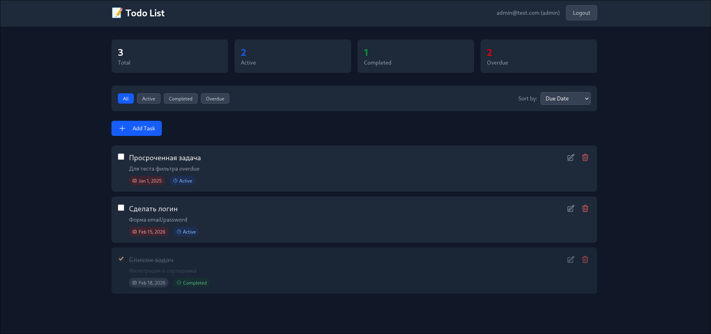
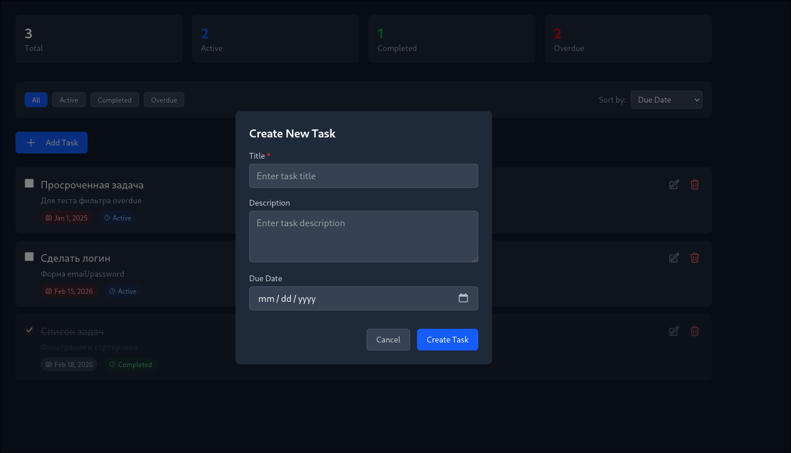

# Todo List Test

Монорепозиторий с фронтендом и бэкендом:
- Frontend: Nuxt 3 + Pinia + Tailwind + TypeScript
- Backend: Express + TypeScript (in-memory DB)

## 1. Требования

- Node.js 20+
- npm 10+

## 2. Установка

```bash
npm install
```

## 3. Переменные окружения

Создайте `.env` в корне на основе `.env.example`.

```bash
cp .env.example .env
```

### Переменные

| Переменная | По умолчанию | Где используется |
|---|---|---|
| `NUXT_PUBLIC_API_BASE` | `/api` | Nuxt runtimeConfig |
| `NUXT_PUBLIC_API_URL` | `http://localhost:3001` | Базовый URL API |
| `PORT` | `3001` | Express server |
| `NODE_ENV` | `development` | Front/Back режим |

## 4. Запуск

### Вариант A: фронт + бэк одновременно

```bash
npm run dev:all
```

- Frontend: http://localhost:3000
- Backend: http://localhost:3001

### Вариант B: раздельно

Терминал 1:
```bash
npm run server
```

Терминал 2:
```bash
npm run dev
```

## 5. Production

```bash
npm run build
npm run preview
```

## 6. Тестовые аккаунты

| Email | Password | Role |
|---|---|---|
| `admin@test.com` | `123456` | `admin` |
| `user@test.com` | `123456` | `user` |

## 7. API Endpoints

Базовый префикс: `/api`

### Auth

#### `POST /api/auth/login`

Request:
```json
{
  "email": "user@test.com",
  "password": "123456"
}
```

Response `200`:
```json
{
  "token": "uuid",
  "user": {
    "id": "uuid",
    "email": "user@test.com",
    "role": "user"
  }
}
```

Response `401`:
```json
{ "message": "Invalid email or password" }
```

### Tasks

Все эндпоинты требуют заголовок:

```http
Authorization: Bearer <token>
```

#### `GET /api/tasks`

Query params:
- `filter=all|active|completed|overdue`
- `sort=dueDate|createdAt|status`

Response `200`:
```json
{
  "data": [
    {
      "id": "uuid",
      "title": "Task title",
      "description": "...",
      "dueDate": "2026-12-31",
      "isCompleted": false,
      "ownerId": "uuid",
      "createdAt": "ISO",
      "updatedAt": "ISO"
    }
  ],
  "meta": {
    "total": 1,
    "filter": "active",
    "sort": "dueDate"
  }
}
```

#### `POST /api/tasks`

Request:
```json
{
  "title": "Новая задача",
  "description": "Описание",
  "dueDate": "2026-12-31"
}
```

Response `201`:
```json
{
  "id": "uuid",
  "title": "Новая задача",
  "description": "Описание",
  "dueDate": "2026-12-31",
  "isCompleted": false,
  "ownerId": "uuid",
  "createdAt": "ISO",
  "updatedAt": "ISO"
}
```

#### `PUT /api/tasks/:id`

Request:
```json
{
  "title": "Обновленная задача",
  "description": "...",
  "dueDate": "2026-12-31",
  "isCompleted": true
}
```

Response `200`: обновленная задача.

#### `DELETE /api/tasks/:id`

Response `204`: empty body.

## 8. Частые коды ответов

- `200` OK
- `201` Created
- `204` No Content
- `400` Validation failed
- `401` Unauthorized
- `403` Forbidden
- `404` Not found
- `500` Internal server error

## 9. Архитектура сторов

- `stores/api/api.ts` — только HTTP запросы
- `stores/model/*.store.ts` — бизнес-логика
- `stores/index.ts` — публичные экспорты

## 10. Структура проекта

```text
.
├── pages/              # Nuxt pages
├── components/         # UI + feature components
├── shared/ui/          # переиспользуемые UI примитивы
├── stores/
│   ├── api/
│   ├── model/
│   └── index.ts
├── plugins/
├── server/
│   ├── routes/
│   ├── middleware/
│   ├── validators/
│   └── data/
└── types/
```

## 11. Скриншоты

### Login Page



### Home Page



### Create Task Modal


